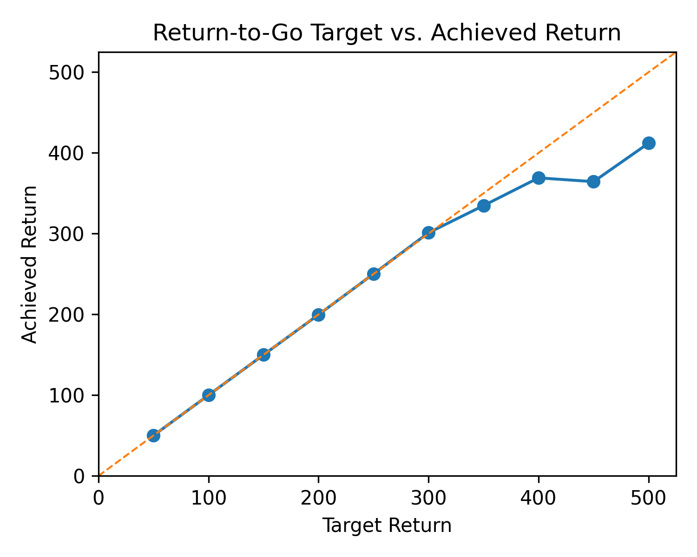
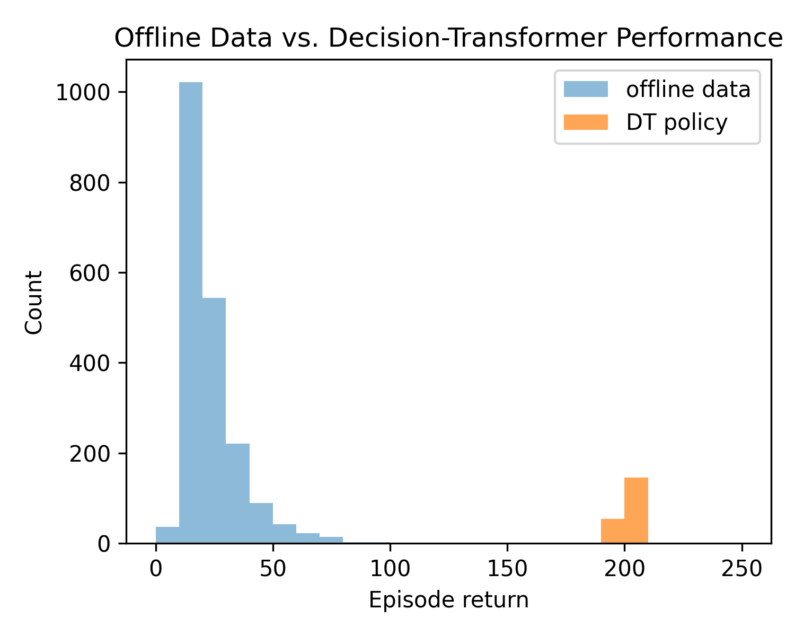

# Decision Transformer for Offline RL in CartPole-v1

A **single-file, minimal** re-implementation of the Decision Transformer (Chen *et al.*, 2021) for the classic CartPole-v1 control task.

The script **`decision_transformer_cartpole.py`**

1. **Generates** an offline dataset of 2 000 random-policy episodes  
2. **Trains** a small GPT-style Transformer **offline** to predict actions conditioned on Return-To-Go (RTG)  
3. **Evaluates** the learned policy online, reliably reaching the maximum return of **200**

All ancillary scripts and SLURM job files are provided to reproduce the run, generate the figures below, and inspect the model’s internals.

<p align="center" style="display:flex; gap:12px; justify-content:center;">
  
  
</p>

<p align="center">
  <em>Left:</em> How closely the DT hits user-specified RTG targets. &nbsp;|&nbsp;
  <em>Right:</em> Episode-return distribution of the offline data vs. the trained DT policy.
</p>

---

## Key Features

* **Compact** – all core logic (~250 LOC) lives in a single, dependency-free `decision_transformer_cartpole.py`
* **Self-contained** – generates its own offline dataset; no external replay buffer needed
* **Return-conditioning** – one network can target arbitrary returns at inference time
* **GPU-ready** – CUDA automatically detected; runs in ≈18 min on a single RTX 2080 Ti (see `dt_cartpole.26704262.err`)
* **Diagnostics & visualizations** – scripts for attention maps, latent-space projections, RTG-vs-return plots, and histograms

---

## 🚀 Quick Start

### 1. Install dependencies

```bash
python -m venv venv && source venv/bin/activate
pip install torch gymnasium numpy tqdm matplotlib scikit-learn umap-learn
```

### 2. Train & evaluate locally

```bash
python decision_transformer_cartpole.py
```

Logs and a checkpoint (`best_dt.pt`) are written to the project root.

### 3. (Optional) Run on an HPC cluster

Edit the partitions/paths in `run_dt.slurm` and submit:

```bash
sbatch run_dt.slurm
```

To regenerate all figures in batch:

```bash
sbatch dt_plots.slurm
```

---

## 🗂️ Repository Layout

| File                           | Purpose                                          |
|--------------------------------|--------------------------------------------------|
| `decision_transformer_cartpole.py` | Offline dataset creation, training loop, evaluation |
| `best_dt.pt`                   | Pre-trained weights (~3 MB)                      |
| `run_dt.slurm`                 | ≈18-minute training job for one GPU node           |
| `dt_plots.slurm`               | SLURM job to generate all figures                |
| `target_vs_return.py`          | RTG target vs. achieved return plot              |
| `return_histogram.py`          | Offline-vs-DT return histogram                   |
| `attention_heatmap_white.py`   | Last-layer attention heat-map                    |
| `latent_space_map.py`          | t-SNE/UMAP/PCA of state embeddings               |
| `*.png`                        | Pre-generated figures for quick viewing          |
| `*.err`, `*.out`               | SLURM stdout/stderr logs (kept for reference)    |

---

## 📊 Results

| Metric                         | Score (mean ± std, 20 episodes)                 |
|--------------------------------|-------------------------------------------------|
| **Return (@ RTG = 200)**       | **199.9 ± 0.4**                                 |
| Solved threshold (CartPole-v1) | **≥ 195 for 100 consecutive episodes**          |

Qualitatively, the model:

* **Generalizes** across RTG targets from 50 → 500  
* Learns **interpretable attention** focusing on the most recent `(state, action)` tokens  
* Embeds states into a **linearly separable latent space** with clear action clusters  

---

## 🛠 Default Hyper-parameters

```text
context_len  = 30     embed_dim  = 128
n_layers     = 6      n_heads    = 8
batch_size   = 64     lr         = 3e-4
train_steps  = 50 000 dropout    = 0.1
```

See the `Config` dataclass at the top of `decision_transformer_cartpole.py` for the complete list.

---

## 📑 Citation

```bibtex
@article{chen2021decisiontransformer,
  title   = {Decision Transformer: Reinforcement Learning via Sequence Modeling},
  author  = {Chen, Lili and Lu, Kevin and Rajeswaran, Aravind and Lee, Kimin and
             Grover, Aditya and Laskin, Michael and Abbeel, Pieter and
             Srinivas, Aravind and Mordatch, Igor},
  journal = {arXiv preprint arXiv:2106.01345},
  year    = {2021}
}
```

## License
This project is released under the MIT License. See [LICENSE](./LICENSE).

Please cite this repo if you use it in your work.
